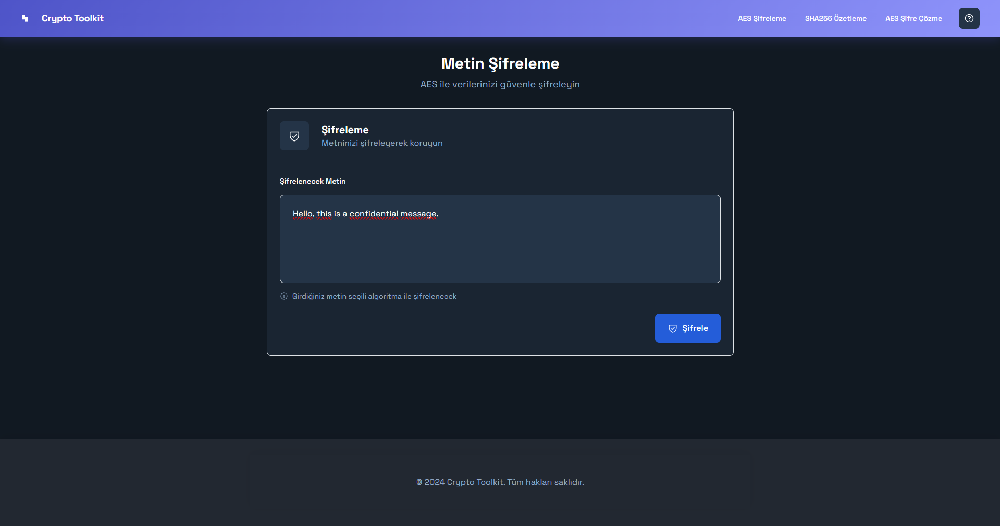
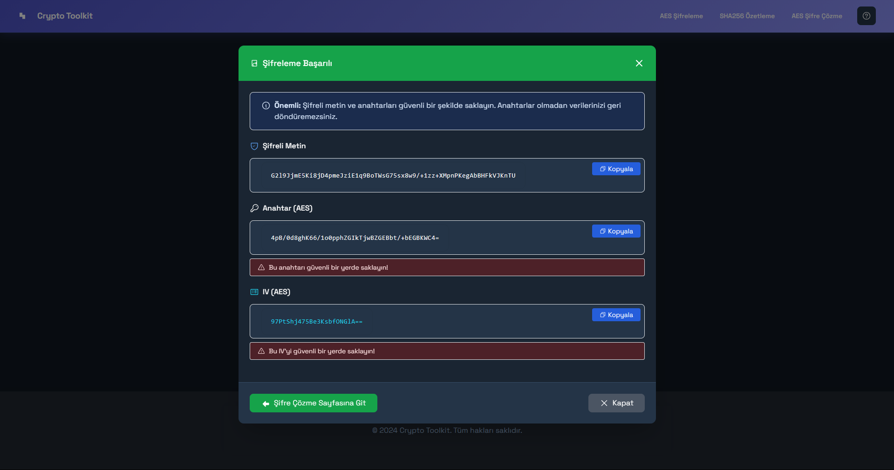
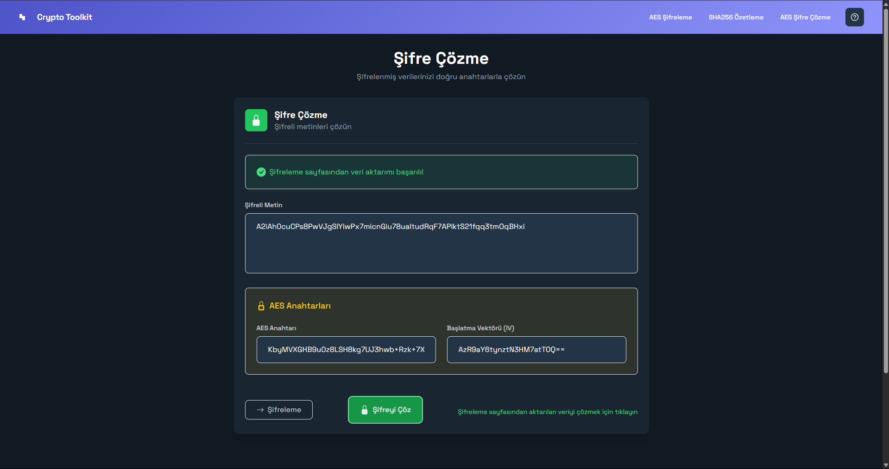
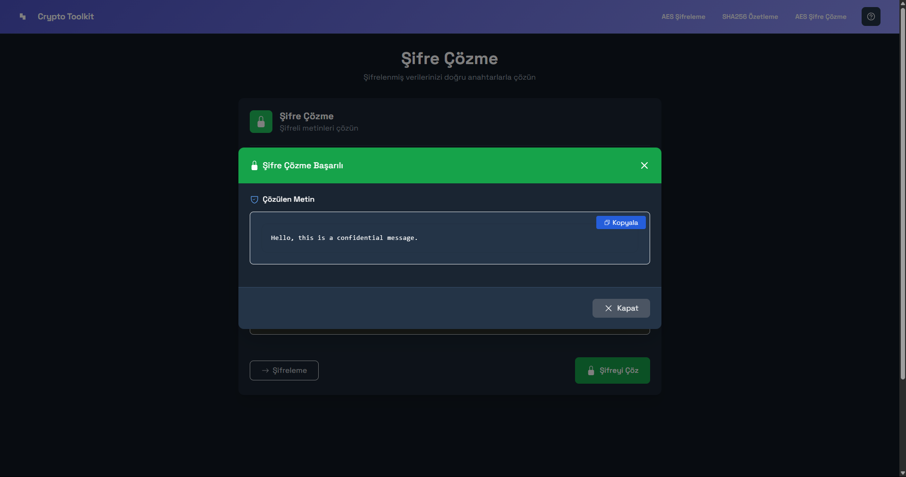
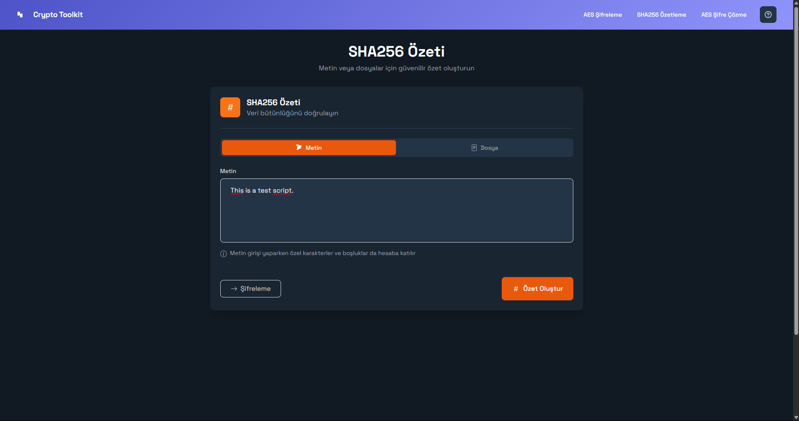
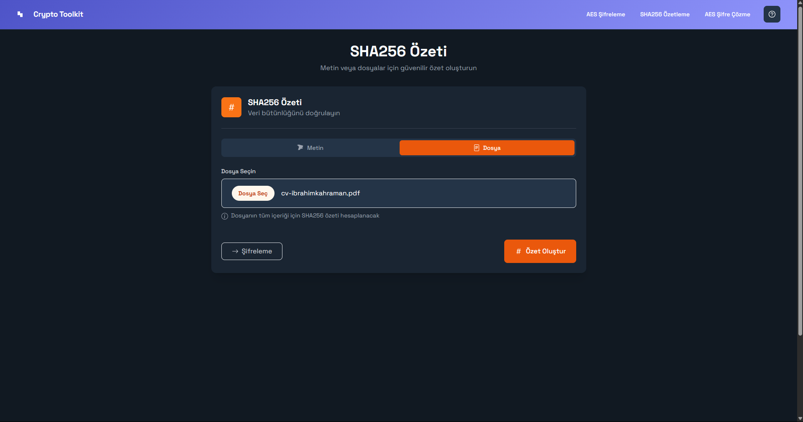
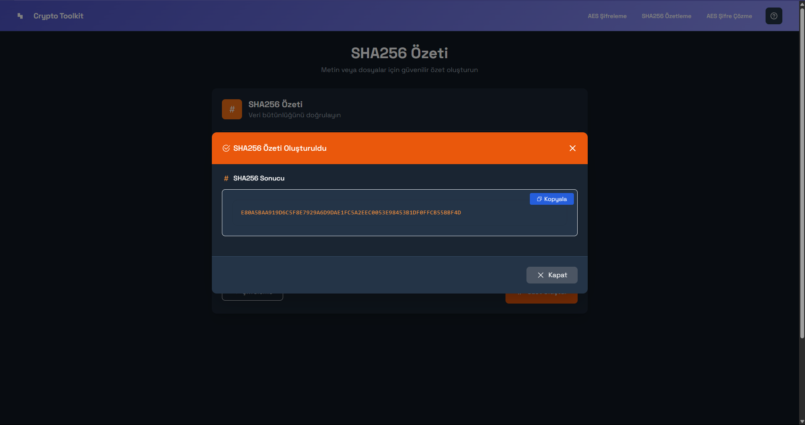

# CryptoToolkit

CryptoToolkit is an ASP.NET Core MVC web application that provides a set of tools for common cryptographic operations, including AES encryption/decryption and SHA256 hashing.

## Screenshots

### AES Encryption



### AES Decryption



### SHA256 Hashing




## Features

*   **AES Encryption**: Encrypts plaintext using AES (Advanced Encryption Standard). It generates a ciphertext, a unique key, and an initialization vector (IV).
*   **AES Decryption**: Decrypts ciphertext back to plaintext using the corresponding key and IV.
*   **SHA256 Hashing**: Computes the SHA256 hash for a given text input or an uploaded file.

## Technologies Used

*   **Backend**: ASP.NET Core MVC, C# (.NET 9)
*   **Frontend**: HTML, CSS, JavaScript
*   **Styling**: Bootstrap
*   **Client-side Scripting**: jQuery

## Setup and Installation

To run this project locally, you'll need the .NET 9 SDK installed.

1.  **Clone the repository (if applicable) or download the source code.**
    ```bash
    # If you have it in a git repository
    # git clone <repository-url>
    # cd CryptoToolkit
    ```

2.  **Navigate to the web project directory:**
    ```bash
    cd CryptoToolkit.Web
    ```

3.  **Build the project:**
    ```bash
    dotnet build
    ```

4.  **Run the project:**
    ```bash
    dotnet run
    ```
    The application will typically be available at `https://localhost:xxxx` or `http://localhost:xxxx`, where `xxxx` is a port number assigned by Kestrel. Check the console output for the exact URL.

## Usage

Once the application is running, you can access the different tools via the navigation bar or by directly visiting their URLs:

*   ### Encrypt (`/Crypto/Encrypt`)
    
    
    
    1.  Navigate to the "Encrypt" page.
    2.  Enter the plaintext you want to encrypt in the text area.
    3.  Click the "Encrypt" button.
    4.  The application will display the generated Ciphertext, AES Key, and AES IV.
    5.  You can copy these values or use the "Go to Decrypt page" button, which will take you to the Decrypt page with these values pre-filled.
    
    

*   ### Decrypt (`/Crypto/Decrypt`)
    
    
    
    1.  Navigate to the "Decrypt" page.
    2.  If you came from the Encrypt page, the Ciphertext, Key, and IV fields might be pre-filled. Otherwise, enter the Ciphertext, the AES Key, and the AES IV.
    3.  Click the "Decrypt" button.
    4.  The application will display the original plaintext.
    
    

*   ### Hash (`/Crypto/Hash`)
    
    
    
    1.  Navigate to the "Hash" page.
    2.  You can either:
        *   Enter text directly into the text area.
        *   Upload a file using the file input.
    3.  Click the "Compute Hash" button.
    4.  The application will display the SHA256 hash of the input text or file.
    
    
    
    

## Project Structure

The main components of the project are organized as follows:

*   `CryptoToolkit.sln`: Visual Studio solution file.
*   `CryptoToolkit.Web/`: The ASP.NET Core MVC web application.
    *   `Controllers/`: Contains C# controller classes that handle HTTP requests and orchestrate responses.
        *   `CryptoController.cs`: Handles all cryptographic operations (encryption, decryption, hashing).
        *   `HomeController.cs`: Handles basic home page requests.
    *   `Models/`: Defines C# classes for data representation (view models).
        *   `AesModel.cs`: Model for AES encryption/decryption data.
        *   `Sha256Model.cs`: Model for SHA256 hashing data.
        *   `FileUploadModel.cs`: Model for file uploads in hashing.
    *   `Services/`: Contains C# service classes that encapsulate the core logic for cryptographic operations.
        *   `AesService.cs`: Implements AES encryption and decryption.
        *   `Sha256Service.cs`: Implements SHA256 hashing.
    *   `Views/`: Contains Razor (.cshtml) files for rendering the user interface.
        *   `Crypto/`: Views related to cryptographic tools (`Encrypt.cshtml`, `Decrypt.cshtml`, `Hash.cshtml`).
        *   `Shared/`: Shared layout files and partial views.
    *   `wwwroot/`: Contains static web assets like CSS, JavaScript, and libraries (Bootstrap, jQuery).
    *   `Program.cs`: The main entry point for the application, where services are configured and the HTTP request pipeline is set up.
    *   `appsettings.json`: Configuration file for the application.

## Contributing

Contributions are welcome! If you have suggestions for improvements or find any issues, please feel free to open an issue or submit a pull request (if this were a public repository).

